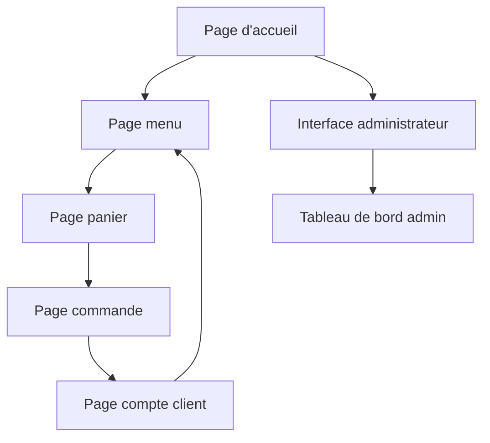

# Document d'Exigences - Système de Commande de Pizza en Ligne

## 1. Aperçu du Produit

Système de commande de pizza en ligne inspiré du design d'Oh'Pizza, permettant aux clients de commander des pizzas personnalisées avec paiement PayPal intégré. <mcreference link="https://ohpizza.fr/" index="0">0</mcreference>

Le système vise à digitaliser l'expérience de commande de pizzas avec une interface moderne, une gestion complète des comptes clients et un back-office administrateur pour la gestion des produits et prix.

**Architecture technique :** Backend Express.js, Frontend React, Base de données MySQL pour une solution moderne et performante.

## 2. Fonctionnalités Principales

### 2.1 Rôles Utilisateur

| Rôle | Méthode d'Inscription | Permissions Principales |
|------|----------------------|-------------------------|
| Client | Inscription par email | Commande, consultation du menu, gestion du profil |
| Administrateur | Accès par identifiants admin | Gestion complète des produits, ingrédients, commandes et prix |

### 2.2 Module Fonctionnel

Notre système de commande de pizza comprend les pages principales suivantes :

1. **Page d'accueil** : présentation du restaurant, navigation principale, menu des pizzas par catégories
2. **Page menu** : catalogue complet des pizzas avec filtres par catégorie, personnalisation des pizzas
3. **Page panier** : récapitulatif des commandes, modification des quantités, calcul des totaux
4. **Page commande** : informations de livraison, choix du mode de paiement PayPal, confirmation
5. **Page compte client** : profil utilisateur, historique des commandes, adresses de livraison
6. **Interface administrateur** : gestion des ingrédients, création de pizzas, gestion des prix
7. **Tableau de bord admin** : suivi des commandes, statistiques de vente, gestion des clients

### 2.3 Détails des Pages

| Nom de la Page | Nom du Module | Description de la Fonctionnalité |
|----------------|---------------|----------------------------------|
| Page d'accueil | Section héro | Afficher le nom du restaurant, slogan, image principale avec call-to-action "Commander" |
| Page d'accueil | Navigation principale | Menu de navigation vers toutes les sections, panier avec compteur d'articles |
| Page d'accueil | Aperçu du menu | Présentation des catégories de pizzas (Incontournables, Signatures, Gourmets) avec images |
| Page menu | Catalogue de pizzas | Afficher toutes les pizzas par catégorie avec nom, ingrédients, prix et bouton d'ajout au panier |
| Page menu | Personnalisation | Permettre la sélection de la base (tomate/crème), taille, ingrédients supplémentaires |
| Page menu | Filtres et recherche | Filtrer par catégorie, base de sauce, prix, recherche par nom ou ingrédient |
| Page panier | Récapitulatif commande | Lister les articles, quantités, prix unitaires et total avec options de modification |
| Page panier | Calcul des frais | Calculer automatiquement les frais de livraison selon la distance et le montant minimum |
| Page commande | Informations client | Formulaire d'adresse de livraison, téléphone, instructions spéciales |
| Page commande | Paiement PayPal | Intégration PayPal pour le paiement sécurisé avec confirmation de transaction |
| Page commande | Confirmation | Récapitulatif final, numéro de commande, temps de livraison estimé |
| Page compte client | Gestion profil | Modifier informations personnelles, mot de passe, préférences de livraison |
| Page compte client | Historique commandes | Consulter les commandes passées avec détails et possibilité de recommander |
| Interface administrateur | Gestion ingrédients | Créer, modifier, supprimer des ingrédients avec nom, prix, disponibilité |
| Interface administrateur | Création pizzas | Composer des pizzas en sélectionnant base (tomate/crème) et ingrédients |
| Interface administrateur | Gestion prix | Modifier les prix des pizzas, ingrédients, frais de livraison |
| Tableau de bord admin | Suivi commandes | Visualiser les commandes en temps réel, changer les statuts (préparation, livraison) |
| Tableau de bord admin | Statistiques | Afficher les ventes par période, pizzas les plus populaires, revenus |

## 3. Processus Principal

### Flux Client
Le client visite la page d'accueil, navigue vers le menu, sélectionne des pizzas en les personnalisant, les ajoute au panier, procède au checkout avec ses informations de livraison, effectue le paiement via PayPal et reçoit une confirmation de commande.

### Flux Administrateur
L'administrateur se connecte au tableau de bord, gère les ingrédients disponibles, crée ou modifie des pizzas avec leurs compositions, ajuste les prix, suit les commandes en temps réel et met à jour leur statut de préparation.

## 4. Design de l'Interface Utilisateur

### 4.1 Style de Design

- **Couleurs principales** : Rouge (#D32F2F) et blanc (#FFFFFF) pour rappeler l'identité pizza italienne
- **Couleurs secondaires** : Vert (#388E3C) pour les accents, gris (#757575) pour les textes secondaires
- **Style des boutons** : Boutons arrondis avec effet de survol, style moderne et épuré
- **Police** : Roboto pour la lisibilité, tailles 16px pour le texte, 24px pour les titres
- **Style de mise en page** : Design basé sur des cartes, navigation supérieure fixe, layout responsive
- **Icônes** : Style Material Design pour la cohérence, émojis pour les catégories de pizzas 🍕

### 4.2 Aperçu du Design des Pages

| Nom de la Page | Nom du Module | Éléments UI |
|----------------|---------------|-------------|
| Page d'accueil | Section héro | Image de fond pizza, titre en Roboto Bold 32px, bouton CTA rouge arrondi |
| Page menu | Catalogue | Grille de cartes pizzas, images 300x200px, prix en rouge #D32F2F, boutons verts |
| Page panier | Récapitulatif | Liste avec séparateurs, total en gras, boutons d'action colorés |
| Interface admin | Gestion produits | Tableau avec actions, formulaires modaux, couleurs neutres grises |

### 4.3 Responsivité

Le produit est conçu mobile-first avec adaptation desktop, optimisé pour les interactions tactiles sur smartphones et tablettes pour faciliter les commandes en déplacement.

## 5. Architecture Technique

### 5.1 Stack Technologique
- **Frontend** : React.js avec hooks et context API
- **Backend** : Express.js avec middleware de sécurité
- **Base de données** : MySQL avec relations optimisées
- **Authentification** : JWT tokens
- **Paiement** : Intégration PayPal SDK
- **Déploiement** : Docker containers

### 5.2 Structure de la Base de Données MySQL

**Tables principales :**
- `users` : Gestion des comptes (clients et admin)
- `ingredients` : Catalogue des ingrédients
- `pizzas` : Produits avec base (crème/tomate) et prix
- `pizza_ingredients` : Relations many-to-many
- `orders` : Commandes clients
- `order_items` : Détails des commandes
- `payments` : Transactions PayPal

### 5.3 API REST Express.js

**Endpoints principaux :**
- `POST /api/auth/login` : Authentification
- `GET /api/pizzas` : Catalogue produits
- `POST /api/orders` : Création commande
- `POST /api/payments/paypal` : Traitement paiement
- `GET /api/admin/dashboard` : Interface admin
- `POST /api/admin/pizzas` : Gestion produits

### 5.4 Composants React

**Structure modulaire :**
- `components/` : Composants réutilisables
- `pages/` : Pages principales
- `hooks/` : Custom hooks
- `context/` : Gestion d'état global
- `services/` : Appels API
- `utils/` : Fonctions utilitaires